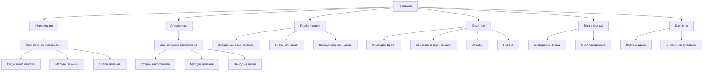
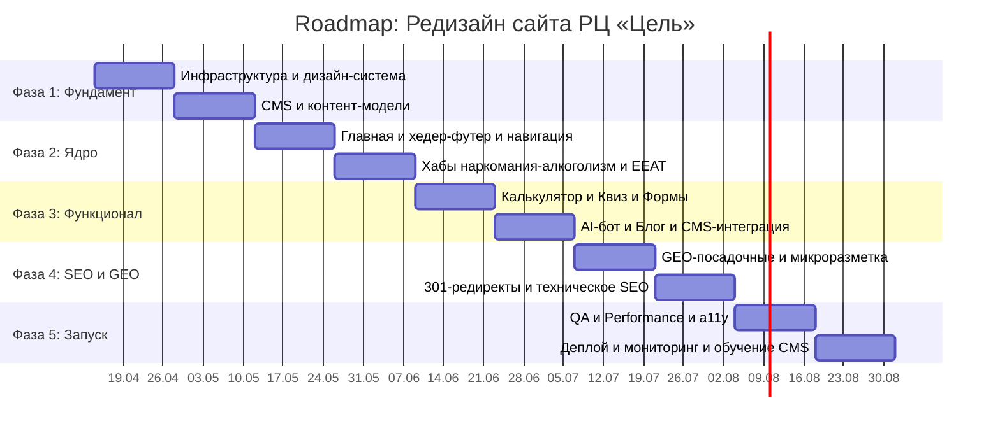

# Техническое задание: Полный редизайн сайта РЦ «Цель»

> **Проект:** Реабилитационный центр «Цель» — lechenie-narkomanii-alkogolizma.ru
> **Версия ТЗ:** 1.0 | **Дата:** 07.04.2026
> **Тип проекта:** YMYL (Your Money Your Life) медицинский веб-проект
> **Стек:** React + Vite (SSR/SSG) · Headless CMS · 21st.dev UI Kit

---

## 1. Анализ текущего состояния

### Критические проблемы, выявленные при аудите

| Параметр | Текущее состояние | Целевое состояние |
|---|---|---|
| **E-E-A-T** | Нулевой. Нет авторов, лицензий, видео | Полное соответствие YMYL |
| **Структура URL** | 100+ плоских страниц, дубли в навигации | Иерархия хабов, ≤3 клика до контента |
| **UX/UI** | Устаревший дизайн, перегруженное меню | Современный, эмпатичный, mobile-first |
| **Core Web Vitals** | Не замерены, визуально медленно | LCP <2.5s, FID <100ms, CLS <0.1 |
| **Микроразметка** | Отсутствует | Schema.org: MedicalOrganization, FAQ, Review |
| **Локальное SEO** | Нет GEO-посадочных | Автогенерация под районы МО |

### Текущая структура (для миграции)

Сайт содержит ~120 страниц в следующих разделах:
- `/lechenie-narkomanii/` — ~50 подстраниц (по веществам)
- `/lechenie-alkogolizma/` — ~30 подстраниц
- `/lechenie/` — программы реабилитации (4 страницы)
- `/informaciya-dlya-rodstvennikov/` — ~10 страниц
- `/company/` — о нас, отзывы, команда
- `/pressa-o-nas/` — пресса

> [!WARNING]
> При редизайне необходимо настроить 301-редиректы со всех старых URL на новые. Потеря индексации недопустима.

---

## 2. Архитектура нового сайта

### 2.1 Карта хабов



### 2.2 Информационная архитектура URL

```
/                                      — Главная (Hero + социальное доказательство)
├── /narkomaniya/                      — Хаб: Лечение наркомании
│   ├── /narkomaniya/opioidnaya/       — Категория: Опиоиды
│   │   ├── /narkomaniya/opioidnaya/geroin/
│   │   └── /narkomaniya/opioidnaya/metadon/
│   ├── /narkomaniya/stimulyatory/     — Категория: Стимуляторы
│   └── /narkomaniya/metody-lecheniya/ — Методы лечения наркомании
├── /alkogolizm/                       — Хаб: Лечение алкоголизма
│   ├── /alkogolizm/stadii/
│   ├── /alkogolizm/kodirovanie/
│   └── /alkogolizm/vyvod-iz-zapoya/
├── /reabilitaciya/                    — Программы реабилитации
│   ├── /reabilitaciya/programma/
│   ├── /reabilitaciya/resocializaciya/
│   └── /reabilitaciya/stoimost/       — Калькулятор цен
├── /o-centre/                         — О центре «Цель»
│   ├── /o-centre/vrachi/              — Команда врачей (E-E-A-T)
│   ├── /o-centre/licenzii/            — Лицензии и сертификаты (E-E-A-T)
│   ├── /o-centre/otzyvy/             — Отзывы (видео + текст)
│   └── /o-centre/pressa/             — Упоминания в прессе
├── /blog/                             — Экспертные статьи (Headless CMS)
├── /geo/                              — GEO-посадочные страницы
│   ├── /geo/podolsk/
│   ├── /geo/mytischi/
│   └── /geo/{город}/                 — Автогенерация
├── /dlya-rodstvennikov/               — Хаб для родственников
├── /kontakty/                         — Контакты + карта
└── /konsultaciya/                     — Онлайн-запись / AI-бот
```

### 2.3 Стек технологий

| Слой | Технология | Обоснование |
|---|---|---|
| **Фреймворк** | React 19 + Vite 6 | Скорость сборки, ESM, широкая экосистема |
| **SSR/SSG** | vite-plugin-ssr (Vike) | SEO-критично для YMYL, гибридный рендеринг |
| **UI-компоненты** | 21st.dev Magic UI | Ускорение визуальной разработки в 3-5x |
| **Стилизация** | Tailwind CSS 4 | Консистентность дизайн-системы, rapid prototyping |
| **CMS** | Strapi 5 (self-hosted) | Headless, REST/GraphQL, русская локализация |
| **AI-бот** | OpenAI API + custom RAG | Первичный сбор анамнеза, маршрутизация |
| **Аналитика** | Yandex Metrika + GA4 | Стандарт для рунета |
| **Хостинг** | VPS (2 vCPU / 4GB) | SSR требует серверный рендеринг |
| **CDN** | Cloudflare | Кэширование статики, DDoS-защита |

---

## 3. Функциональные требования

### 3.1 Модуль: Hero-блок главной страницы

**Источник UI:** 21st.dev — `hero-section`, `animated-gradient-background`

| Параметр | Описание |
|---|---|
| **Контент** | Эмпатичный заголовок, подзаголовок, CTA «Бесплатная консультация» |
| **Фон** | Мягкий градиент или видео (природа, спокойствие) |
| **CTA** | Кнопка → модал с формой быстрой связи (имя + телефон) |
| **Анимация** | Reveal-анимация текста при скролле, пульсация CTA |
| **Доверие** | Строка с цифрами: «12 лет опыта · 3000+ выпускников · Лицензия №...» |
| **Телефон** | Sticky-кнопка «Позвонить» в хедере + floating mobile |

### 3.2 Модуль: Карточки врачей (E-E-A-T)

**Источник UI:** 21st.dev — `team-section`, `profile-card`, `spotlight-card`

| Параметр | Описание |
|---|---|
| **Данные** | Фото, ФИО, должность, стаж, специализация, сертификаты |
| **Интерактив** | Hover → разворот карточки с деталями и кнопкой «Записаться» |
| **Микроразметка** | `schema.org/Person` с `jobTitle`, `alumniOf`, `award` |
| **CMS** | Управляется через Strapi (коллекция `Doctors`) |

### 3.3 Модуль: Калькулятор стоимости лечения

**Источник UI:** 21st.dev — `multi-step-form`, `slider`, `pricing-card`

| Параметр | Описание |
|---|---|
| **Шаги** | 1) Тип зависимости → 2) Стаж употребления → 3) Программа → 4) Результат |
| **Выход** | Диапазон цены + CTA «Получить точный расчёт» (лид-форма) |
| **Задача** | Прозрачность ценообразования (E-E-A-T), сбор лидов |
| **Логика** | Клиентская, без серверных запросов, формулы в конфиге |

### 3.4 Модуль: AI-бот для первичного анамнеза

| Параметр | Описание |
|---|---|
| **Тип** | Floating chat widget (правый нижний угол) |
| **Поток** | Приветствие → Квиз (тип/стаж/мотивация) → Рекомендация программы → CTA |
| **Бэкенд** | OpenAI API с промптом-инструкцией, ограниченным медицинским контекстом |
| **Ограничения** | Бот НЕ ставит диагнозы; дисклеймер: «Это не медицинская консультация» |
| **Данные** | Анонимизированные логи для аналитики воронки |
| **UI** | 21st.dev — `chat-widget`, `message-bubble` |

### 3.5 Модуль: Квиз «Определи стадию зависимости»

**Источник UI:** 21st.dev — `quiz-form`, `progress-bar`, `steps-indicator`

| Параметр | Описание |
|---|---|
| **Вопросы** | 7-10 вопросов с вариантами ответов (радио-кнопки) |
| **Результат** | Стадия + рекомендованная программа + CTA «Поговорить со специалистом» |
| **Лид** | Форма «Получить результат на email» (опционально) |
| **SEO** | Квиз встраивается на хаб-страницы как виджет |

### 3.6 Модуль: Видео-отзывы и текстовые отзывы

**Источник UI:** 21st.dev — `testimonial-carousel`, `video-player`, `rating-stars`

| Параметр | Описание |
|---|---|
| **Видео** | YouTube/VK Video embed, lazy-load, poster-image |
| **Текст** | Карусель карточек с фото, именем, датой, текстом |
| **Микроразметка** | `schema.org/Review` с `reviewRating`, `author` |
| **CMS** | Коллекция `Reviews` в Strapi (текст + ссылка на видео) |

### 3.7 Модуль: GEO-посадочные страницы

| Параметр | Описание |
|---|---|
| **Шаблон** | Единый шаблон `/geo/{slug}/` с динамическими данными |
| **Контент** | Заголовок с городом, расстояние от центра, локальные CTA, карта |
| **SSG** | Статическая генерация при билде из списка городов в CMS |
| **Города (старт)** | Подольск, Мытищи, Балашиха, Химки, Люберцы, Одинцово, Домодедово, Красногорск, Королёв, Щёлково |
| **Микроразметка** | `schema.org/LocalBusiness` с `areaServed` |

### 3.8 Модуль: Блог / Экспертные статьи

| Параметр | Описание |
|---|---|
| **CMS** | Strapi: `Articles` с полями: title, slug, body (rich text), author (relation → Doctor), category, seo_meta |
| **Страница** | `/blog/{slug}/` — SSG при билде |
| **SEO** | Каждая статья подписана автором-врачом (E-E-A-T), breadcrumbs, `schema.org/Article` |
| **Функции** | TOC (Table of Contents), estimated reading time, related articles |

### 3.9 Модуль: Лицензии и сертификаты (E-E-A-T)

**Источник UI:** 21st.dev — `image-gallery`, `lightbox`, `badge`

| Параметр | Описание |
|---|---|
| **Контент** | Сканы лицензий, фото сертификатов, даты выдачи, кем выданы |
| **Отображение** | Сетка с лайтбоксом для просмотра в полном размере |
| **Доверие** | Бэйдж «Лицензия проверена» с номером и ссылкой на реестр |

### 3.10 Модуль: Общие компоненты

| Компонент | 21st.dev | Описание |
|---|---|---|
| **Хедер** | `navbar`, `mobile-menu` | Логотип, навигация (мега-меню), телефон, CTA |
| **Футер** | `footer-section` | Меню, контакты, соцсети, юридические ссылки |
| **Breadcrumbs** | `breadcrumbs` | На всех внутренних страницах |
| **CTA-баннер** | `cta-banner`, `animated-button` | «Бесплатная консультация 24/7» — повторяется через контент |
| **FAQ-блок** | `accordion`, `faq-section` | schema.org/FAQPage, на каждом хабе |
| **Cookie-бар** | `cookie-consent` | GDPR/152-ФЗ compliance |
| **404 страница** | `error-page` | С поиском и навигацией |

---

## 4. Нефункциональные требования

### 4.1 Производительность (Core Web Vitals)

| Метрика | Целевое значение | Инструмент замера |
|---|---|---|
| LCP (Largest Contentful Paint) | < 2.5 сек | Lighthouse, PageSpeed Insights |
| FID / INP (Interaction to Next Paint) | < 200 мс | Chrome UX Report |
| CLS (Cumulative Layout Shift) | < 0.1 | Lighthouse |
| TTFB (Time to First Byte) | < 600 мс | WebPageTest |
| Общий балл PageSpeed (Mobile) | ≥ 90 | PageSpeed Insights |

### 4.2 Оптимизация

- **Изображения:** WebP/AVIF, lazy-loading, responsive `srcset`
- **Шрифты:** `font-display: swap`, предзагрузка через `<link rel="preload">`
- **JS-бандл:** Code splitting по маршрутам, tree-shaking
- **CSS:** Critical CSS inline, остальное — async
- **Кэширование:** Service Worker для оффлайн-оболочки, Cloudflare Edge Cache

### 4.3 Адаптивность

| Breakpoint | Диапазон | Особенности |
|---|---|---|
| Mobile | 320–767px | Одноколоночный layout, hamburger-меню, sticky CTA-кнопка |
| Tablet | 768–1023px | Двухколоночный, адаптированная навигация |
| Desktop | 1024–1440px | Полный layout, мега-меню |
| Wide | 1441px+ | Max-width контейнера 1280px, центрирование |

### 4.4 Доступность (a11y)

- WCAG 2.1 Level AA
- Контрастность текста ≥ 4.5:1
- Все интерактивные элементы доступны с клавиатуры
- ARIA-атрибуты для кастомных виджетов (квиз, калькулятор, чат)
- `alt`-тексты для всех изображений

### 4.5 Безопасность

- HTTPS (SSL-сертификат Let's Encrypt, auto-renew)
- CSP (Content Security Policy) headers
- Санитизация форм (XSS / SQL-injection prevention)
- Rate limiting для форм и API-бота
- 152-ФЗ: Согласие на обработку персональных данных на каждой форме

### 4.6 SEO-техническая база

- **Canonical URL** на каждой странице
- **XML Sitemap** (автогенерация при билде)
- **robots.txt** с указанием sitemap
- **hreflang** — не требуется (одноязычный проект)
- **Open Graph + Twitter Cards** для всех страниц
- **Structured Data** (см. раздел микроразметки)

---

## 5. E-E-A-T стратегия (YMYL compliance)

> [!IMPORTANT]
> Для YMYL-тематики (медицина, зависимости) Google применяет повышенные требования к E-E-A-T. Каждый сигнал ниже критически важен для ранжирования.

### 5.1 Experience (Опыт)

| Элемент | Реализация |
|---|---|
| Истории выздоровления | Видео-отзывы реальных пациентов с датой и контекстом |
| Фотогалерея центра | Реальные фото помещений, занятий, территории (не стоки) |
| Блог от практикующих врачей | Каждая статья подписана врачом с фото и квалификацией |

### 5.2 Expertise (Экспертность)

| Элемент | Реализация |
|---|---|
| Профили врачей | Образование, стаж, сертификаты, публикации |
| Авторство статей | `schema.org/Person` + ссылка на профиль автора |
| Лицензии | Страница `/o-centre/licenzii/` с верифицированными документами |
| Экспертный контент | Статьи рецензируются главным врачом (указано в блоге) |

### 5.3 Authoritativeness (Авторитетность)

| Элемент | Реализация |
|---|---|
| Пресса | Страница упоминаний в СМИ с ссылками на источники |
| Партнёрства | Логотипы партнёров (клиники, медцентры) |
| Возраст бренда | «Работаем с 20XX года» — в хедере и на главной |
| NAP-консистентность | Единые данные на сайте, в Яндекс.Бизнес, Google Maps, 2ГИС |

### 5.4 Trustworthiness (Доверие)

| Элемент | Реализация |
|---|---|
| Прозрачные цены | Калькулятор стоимости без скрытых платежей |
| Юридические документы | Политика конфиденциальности, договор оферты, 152-ФЗ |
| Контактная информация | Адрес на карте, телефон, email, часы работы — на каждой странице |
| Реальные отзывы | Видео + верифицированные текстовые + агрегатор (Яндекс Отзывы) |
| Гарантии | Условия возврата, повторный курс — чётко прописаны |

---

## 6. Микроразметка Schema.org

```json
// Главная страница
{
  "@type": "MedicalOrganization",
  "name": "Реабилитационный центр «Цель»",
  "url": "https://...",
  "logo": "...",
  "telephone": "+7 495 414 11 13",
  "address": { "@type": "PostalAddress" },
  "areaServed": ["Москва", "Московская область"],
  "medicalSpecialty": ["Наркология", "Психиатрия"],
  "hasCredential": { "@type": "MedicalLicense" }
}

// Страницы врачей
{ "@type": "Person", "jobTitle": "Психолог-консультант" }

// Блог
{ "@type": "Article", "author": { "@type": "Person" } }

// Отзывы
{ "@type": "Review", "reviewRating": { "@type": "Rating" } }

// FAQ-секции
{ "@type": "FAQPage", "mainEntity": [] }

// GEO-посадочные
{ "@type": "LocalBusiness", "areaServed": "Подольск" }
```

---

## 7. Локальное SEO (GEO-посадочные)

### 7.1 Архитектура

- **Маршрут:** `/geo/{slug}/`
- **Генерация:** SSG при билде из коллекции `GeoPages` в Strapi
- **Шаблон:** Единый компонент `GeoLandingPage.tsx`

### 7.2 Контент каждой GEO-страницы

| Блок | Контент |
|---|---|
| H1 | «Реабилитация от зависимости в {Город}» |
| Расстояние | «Наш центр находится в {X} км от {Город}» + карта |
| Локальные преимущества | «Удобная транспортная доступность из {Город}» |
| Отзывы | Фильтрованные отзывы от пациентов из этого региона |
| FAQ | Локализованные вопросы («Как добраться из {Город}?») |
| CTA | «Бесплатная консультация для жителей {Город}» |
| Микроразметка | `LocalBusiness` с `areaServed: {Город}` |

### 7.3 Стартовый список городов (10 шт.)

Подольск · Мытищи · Балашиха · Химки · Люберцы · Одинцово · Домодедово · Красногорск · Королёв · Щёлково

> [!TIP]
> Расширение списка городов — это SEO-задача, не входящая в базовое сопровождение (см. раздел SLA).

---

## 8. Границы технической поддержки и SLA

> [!CAUTION]
> Этот раздел является юридически значимым приложением к договору и защищает разработчика от неоплачиваемых переработок.

### 8.1 Базовое сопровождение: 12 000 ₽/мес

#### Что входит:

| Категория | Описание | Лимит |
|---|---|---|
| Мониторинг доступности | Проверка работоспособности сайта, SSL, домена | Ежедневно (автоматизировано) |
| Обновление зависимостей | Патчи безопасности React, Vite, Strapi | До 2 раз/мес |
| Мелкие текстовые правки | Замена телефона, адреса, исправление опечаток | До 5 правок/мес |
| Перезапуск сервисов | Перезапуск при падении (Strapi, Node) | Без лимита |
| Бэкап БД и контента | Еженедельный автоматический бэкап | Автоматически |
| Баг-фикс | Исправление ошибок, вызванных обновлениями | До 4 часов/мес |
| Консультации | Ответы на вопросы по CMS, функционалу | До 1 час/мес |

#### Что **НЕ** входит (тарифицируется отдельно):

| Категория | Примеры | Тарификация |
|---|---|---|
| 🚫 SEO-оптимизация | Внедрение правок от сторонних SEO-подрядчиков, перестройка метатегов, переписывание контента | Отдельная смета, от 5 000 ₽/час |
| 🚫 Массовая генерация страниц | Создание новых GEO-посадочных, добавление новых хабов, массовый импорт статей | Отдельный проект, оценка по ТЗ |
| 🚫 Перестройка структуры | Изменение URL-схемы, редиректы, перестройка навигации под новое семантическое ядро | Отдельный проект, от 30 000 ₽ |
| 🚫 Новый функционал | Новые модули (онлайн-оплата, личный кабинет, CRM-интеграция) | Отдельная смета по ТЗ |
| 🚫 Дизайн-изменения | Редизайн секций, новые лендинги, A/B-тестирование | Отдельная смета, от 15 000 ₽ |
| 🚫 Контент-маркетинг | Написание статей, создание видео, ведение соцсетей | Не входит в компетенцию |
| 🚫 Агрессивное SEO | Линкбилдинг, PBN, спамные стратегии | Категорически не осуществляется |

### 8.2 Регламент работы со сторонними SEO-подрядчиками

> [!WARNING]
> Разработчик не несёт ответственности за последствия внедрения рекомендаций сторонних SEO-специалистов.

**Порядок взаимодействия:**

1. Заказчик предоставляет список SEO-рекомендаций в письменном виде
2. Разработчик оценивает трудоёмкость и стоимость внедрения
3. Работа начинается только после согласования сметы и оплаты
4. Срок оценки — до 3 рабочих дней
5. Ускоренная оценка (1 день) — с коэффициентом 1.5

**Исключения из ответственности:**

- Падение позиций после внедрения SEO-правок стороннего подрядчика
- Санкции поисковых систем за контент, предоставленный заказчиком
- Последствия массовой генерации низкокачественных страниц

### 8.3 SLA: Время реакции

| Приоритет | Описание | Время реакции | Время решения |
|---|---|---|---|
| 🔴 Критический | Сайт недоступен, утечка данных | 1 час | 4 часа |
| 🟡 Высокий | Не работает форма, ошибки отображения | 4 часа | 1 рабочий день |
| 🟢 Средний | Текстовые правки, мелкие баги | 1 рабочий день | 3 рабочих дня |
| ⚪ Низкий | Косметические улучшения, пожелания | 3 рабочих дня | По согласованию |

### 8.4 Каналы связи

- **Telegram:** основной канал (поддержка в рабочие дни 10:00–19:00)
- **Email:** для фиксации задач и сметных документов
- **Экстренный телефон:** только для критических (🔴) инцидентов

---

## 9. Roadmap проекта

### Общий тайминг: 10 спринтов (20 недель)

> **Спринт = 2 недели.** Оценки учитывают ускорение за счёт 21st.dev (коэффициент ~0.6x для UI-задач).



### Детализация спринтов

---

#### Спринт 1 (Нед. 1-2): Инфраструктура и дизайн-система

- [ ] Инициализация проекта: React + Vite + Vike (SSR/SSG)
- [ ] Настройка Tailwind CSS 4 + дизайн-токены (цвета, типографика, spacing)
- [ ] Подключение 21st.dev компонентов, настройка импортов
- [ ] Структура проекта: роутинг, layouts, общие компоненты
- [ ] CI/CD: GitHub Actions → VPS deploy pipeline
- [ ] Настройка ESLint, Prettier, Husky

**Результат:** Работающий dev-сервер, дизайн-система, CI/CD pipeline.

---

#### Спринт 2 (Нед. 3-4): CMS и контент-модели

- [ ] Установка и настройка Strapi 5 на VPS
- [ ] Контент-модели: Doctors, Articles, Reviews, GeoPages, Licenses, FAQ
- [ ] Настройка медиа-хранилища (Cloudflare R2 / S3)
- [ ] API-эндпоинты: REST для фронтенда
- [ ] Заполнение тестового контента (5 врачей, 10 статей, 10 отзывов)
- [ ] Роли и права доступа в CMS

**Результат:** Полностью работающая CMS с тестовыми данными.

---

#### Спринт 3 (Нед. 5-6): Главная страница и навигация

**UI — 21st.dev**
- [ ] Hero-блок: `hero-section` + `animated-gradient` + CTA-форма
- [ ] Хедер: `navbar` с мега-меню + `mobile-menu`
- [ ] Футер: `footer-section` + контакты + юр. ссылки
- [ ] Trust-бар: статистика центра (анимированные счётчики)
- [ ] Секция «Как мы работаем»: `steps-section` / `timeline`
- [ ] CTA-баннер: `cta-banner` + `animated-button`
- [ ] Секция отзывов на главной: `testimonial-carousel`

**Результат:** Полная главная страница с навигацией.

---

#### Спринт 4 (Нед. 7-8): Хабы и E-E-A-T

- [ ] Шаблон хаб-страницы (наркомания, алкоголизм)
- [ ] Шаблон подстраницы (конкретное вещество/методика)
- [ ] Страница «О центре»: история, миссия, фотогалерея
- [ ] Страница врачей: `profile-card` с разворотом + `spotlight-card`
- [ ] Страница лицензий: `image-gallery` + `lightbox`
- [ ] Страница отзывов: видео + текстовые + `rating-stars`
- [ ] Breadcrumbs на всех внутренних страницах

**Результат:** Полные хаб-страницы и E-E-A-T инфраструктура.

---

#### Спринт 5 (Нед. 9-10): Калькулятор, квиз, формы

**UI — 21st.dev**
- [ ] Калькулятор: `multi-step-form` + `slider` + формулы расчёта
- [ ] Квиз: `quiz-form` + `progress-bar` + результаты
- [ ] Формы связи: валидация, маска телефона, 152-ФЗ checkbox
- [ ] Модальные окна: `modal` для быстрой записи
- [ ] Интеграция форм: отправка на email + Telegram-бот уведомления
- [ ] Cookie-consent: `cookie-consent` (152-ФЗ)

**Результат:** Все интерактивные модули работают.

---

#### Спринт 6 (Нед. 11-12): AI-бот и блог

- [ ] AI-бот: виджет `chat-widget`, интеграция OpenAI API
- [ ] Промпт-инжениринг: инструкция бота для первичного анамнеза
- [ ] Rate-limiting, модерация, дисклеймеры
- [ ] Блог: шаблон статьи (TOC, reading time, author, related)
- [ ] Интеграция Strapi → фронтенд для статей
- [ ] Страница «Для родственников»

**Результат:** AI-бот и блог-система полностью функциональны.

---

#### Спринт 7 (Нед. 13-14): GEO-посадочные и микроразметка

- [ ] Шаблон GEO-страницы: `GeoLandingPage.tsx`
- [ ] Интеграция данных из Strapi (коллекция GeoPages)
- [ ] SSG-генерация 10 GEO-страниц при билде
- [ ] Карта (Яндекс.Карты API) на GEO-страницах
- [ ] Внедрение Schema.org микроразметки на все типы страниц
- [ ] Валидация через Google Rich Results Test

**Результат:** GEO-посадочные и полная микроразметка.

---

#### Спринт 8 (Нед. 15-16): Миграция SEO и редиректы

- [ ] Маппинг старых URL → новых URL (120+ редиректов)
- [ ] Настройка 301-редиректов на уровне сервера (nginx)
- [ ] XML Sitemap автогенерация
- [ ] robots.txt
- [ ] Canonical URL на всех страницах
- [ ] Open Graph + Twitter Cards meta-теги
- [ ] Проверка индексации старых страниц

**Результат:** Бесшовная SEO-миграция.

---

#### Спринт 9 (Нед. 17-18): QA, производительность, a11y

- [ ] Кроссбраузерное тестирование (Chrome, Safari, Firefox, Edge)
- [ ] Мобильное тестирование (iOS Safari, Android Chrome)
- [ ] Lighthouse audit → оптимизация до ≥90 баллов
- [ ] a11y аудит: WAVE, axe DevTools
- [ ] Нагрузочное тестирование (k6 / Apache Bench)
- [ ] Исправление всех найденных багов
- [ ] Финальная проверка микроразметки

**Результат:** Сайт готов к продакшену.

---

#### Спринт 10 (Нед. 19-20): Деплой и запуск

- [ ] Настройка production-сервера (VPS: nginx, Node, PM2)
- [ ] DNS-переключение, SSL-сертификат
- [ ] Подключение Yandex Metrika + GA4
- [ ] Подключение Яндекс.Вебмастер + Google Search Console
- [ ] Обучение заказчика работе с CMS (видео-инструкция)
- [ ] Мониторинг: UptimeRobot + алерты в Telegram
- [ ] Документация для сопровождения
- [ ] Подписание акта приёмки

**Результат:** 🚀 Сайт в продакшене, заказчик обучен, мониторинг включен.

---

## 10. Ориентировочная смета

| Фаза | Спринты | Описание | Стоимость |
|---|---|---|---|
| Фундамент | 1-2 | Инфра + CMS | 120 000 ₽ |
| Ядро | 3-4 | Главная + Хабы + E-E-A-T | 150 000 ₽ |
| Функционал | 5-6 | Калькулятор + AI-бот + Блог | 180 000 ₽ |
| SEO & GEO | 7-8 | GEO-посадочные + миграция | 120 000 ₽ |
| Запуск | 9-10 | QA + Деплой + Обучение | 100 000 ₽ |
| **ИТОГО** | **10** | **20 недель** | **670 000 ₽** |

> Стоимость ориентировочная. Экономия ~30% за счёт использования 21st.dev UI Kit.

---

## 11. Верификация

### Автоматизированная проверка

```bash
# Lighthouse CI
npx lighthouse https://lechenie-narkomanii-alkogolizma.ru --output=json

# Проверка микроразметки
npx structured-data-testing-tool https://lechenie-narkomanii-alkogolizma.ru

# a11y аудит
npx axe-cli https://lechenie-narkomanii-alkogolizma.ru

# Build проверка
npm run build
```

### Ручная проверка

1. Визуальный аудит каждой ключевой страницы на desktop + mobile
2. Отправка тестовых заявок через все формы
3. Прохождение полного сценария AI-бота
4. Проверка всех комбинаций калькулятора
5. Проверка уникальности контента на 10 GEO-страницах
6. Проверка каждого 301-редиректа
7. CRUD-операции в CMS с проверкой обновления на фронтенде

---

## Приложение А: Глоссарий

| Термин | Определение |
|---|---|
| **E-E-A-T** | Experience, Expertise, Authoritativeness, Trustworthiness — стандарт Google для YMYL |
| **YMYL** | Your Money Your Life — категория с повышенными требованиями качества |
| **SSR/SSG** | Server-Side Rendering / Static Site Generation |
| **CMS** | Content Management System |
| **GEO-посадочная** | Страница, оптимизированная под географический запрос |
| **SLA** | Service Level Agreement |
| **Core Web Vitals** | Метрики Google для пользовательского опыта |

---

*Документ: 07.04.2026 · Версия 1.0*
*Следующий шаг: Ревью → Утверждение → Старт Спринта 1*
